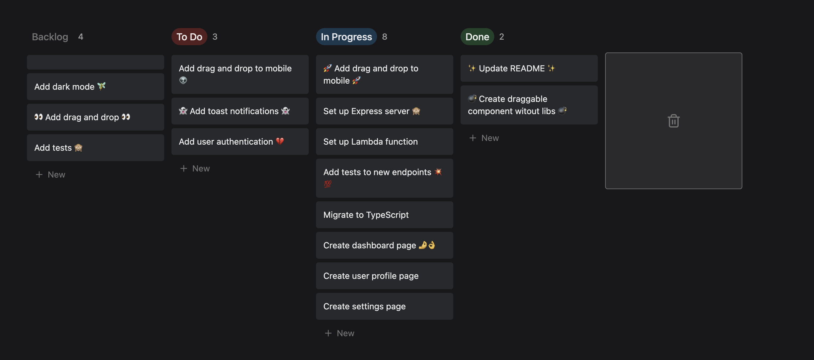

# react-draggable-example

Here's a react draggable kanban board, it's inspired by [Notion's](https://www.notion.so/) task lists ✨
Click [here](https://react-draggable-example.vercel.app/) to see the app or check the preview right here 👇

## What will I see in this build?

👉 React & Typescript

👉 TailwindCSS

👉 Framer Motion

## How to start the project on your local machine?

1. Download or clone this repository

2. Install its dependencies: **npm install**

3. Build the project: **npm run build**

4. Start the project: **npm start**

5. The website is now working, hope you enjoy it 😃